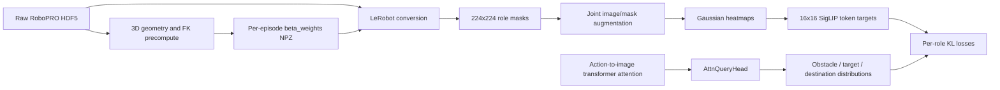

# Obstacle-Guided Attention

This document describes the obstacle-attention extension in the RoboPRO Pi0.5
policy: its components, how contact-oriented ground truth is generated, how the
training pipeline consumes it, and how to precompute, convert, train, and
visualize the system.

The implementation supervises three spatial attention roles:

- **Obstacle**: localized regions where the demonstrated robot trajectory comes
  closest to non-target obstacles.
- **Target**: a localized demonstrated grasp region on the current target.
- **Destination**: the full destination/bin segmentation.

The contact masks replace the old whole-object obstacle and target masks without
changing the LeRobot feature names or the model's observation schema.

## End-to-end data flow



The NPZ cache and converted masks are training labels. They are not required as
policy inputs at inference time.

## Component map

### Geometry and label generation

- `scripts/beta_geometry.py`
  - Loads arm states, end-effector poses, gripper actions, camera calibration,
    actor OBBs, and articulated link OBBs from raw HDF5.
  - Runs ARX5 forward kinematics and estimates the base-to-world transform.
  - Samples robot-body points and computes point-to-OBB distances and closest
    surface anchors.
  - Converts points among world, OBB-local, and normalized OBB-local frames.
- `scripts/precompute_beta_weights.py`
  - Computes centered-window obstacle proximity weights (`beta_t`).
  - Selects centered-window obstacle contact anchors.
  - Infers demonstrated target grasp anchors.
  - Resolves stage-dependent target and destination IDs.
  - Writes one `beta_weights/episodeN.npz` cache per raw episode, either beside
    the source data or under a mirrored writable `--beta-root`.
- `examples/aloha_real/convert_aloha_data_to_lerobot_robotwin.py`
  - Projects cached 3D anchors into the countertop camera.
  - Snaps projections to actor segmentation pixels.
  - Bakes obstacle, beta, target, and destination masks into LeRobot frames.
  - Supports contact masks and the older whole-object baseline.
  - Can precompute and read caches from `--beta-root` when the raw tree is
    read-only.

### Model and loss

- `src/openpi/models/model.py`
  - Adds `obstacle_mask`, `beta_mask`, `target_mask`, and `dest_mask` to
    `Observation`.
  - Applies the same random crop, resize, and rotation to `base_0_rgb` and all
    attention masks, preserving pixel alignment.
- `src/openpi/models/gemma.py`
  - Extracts action-query to `base_0_rgb`-key attention at every transformer
    layer.
  - Renormalizes over base-image tokens and averages over attention heads and
    action queries.
- `src/openpi/models/obstacle_attention.py`
  - Blurs masks into normalized Gaussian heatmaps.
  - Sum-pools heatmaps onto the SigLIP token grid.
  - Defines the shared multi-role `AttnQueryHead`.
  - Computes per-layer KL losses.
- `src/openpi/models/pi0.py`
  - Selects configured transformer layers.
  - Runs the query head and indexes its output by configured role name.
  - Builds ground truth and adds obstacle, target, and destination KL losses.
- `src/openpi/models/pi0_config.py`
  - Defines `ObstacleAttentionConfig`.
  - Derives `role_names` and `num_roles` from `target_attn` and `dest_attn`.
  - Derives the attention grid from image and patch resolution.
- `src/openpi/training/config.py`
  - Defines the `pi05_obs_attn` training configuration and LeRobot feature
    mapping.

### Inspection and tests

- `scripts/generate_contact_heatmap_gif.py`
  - Generates offline GIFs from raw HDF5 and NPZ caches.
  - Does not load a model; it visualizes geometric labels and token targets.
- `scripts/vis_attention_heatmap.py`
  - Loads a trained checkpoint and compares the replacement mask, patchified
    ground truth, and predicted role attention.
- `scripts/beta_geometry_test.py`
  - Tests OBB geometry, target grasp inference, centered contact selection, and
    stage-dependent targets.
- `scripts/contact_masks_test.py`
  - Tests contact projection, fallback behavior, resize/padding, and
    stage-dependent roles.

## Raw data requirements

The precompute and converter expect a hierarchy such as:

```text
<data-root>/
  <domain>/
    <task>/
      <density-or-config>/
        scene_info.json
        masking/
          episode0.json
        data/
          episode0.hdf5
        beta_weights/
          episode0.npz
```

By default, `beta_weights` is written inside each source configuration as shown
above. If `--data-root` is read-only, pass a writable `--beta-root`. The source
hierarchy is mirrored beneath it:

```text
<beta-root>/
  <domain>/
    <task>/
      <density-or-config>/
        beta_weights/
          episode0.npz
```

For example, source
`<data-root>/kitchenl/move_bottle/d15/data/episode0.hdf5` maps to
`<beta-root>/kitchenl/move_bottle/d15/beta_weights/episode0.npz`.

The relevant HDF5 fields include:

- Left and right arm joint states.
- Left and right end-effector world poses.
- Left and right gripper actions (`0` closed, `1` open).
- `actor_bbox/id` and OBB center, half-extents, and quaternion.
- Optional `link_bbox` geometry for articulated furniture.
- Countertop RGB, actor segmentation, camera extrinsics, and intrinsics.

Legacy AABBs are accepted and treated as identity-rotation OBBs.

## Ground-truth generation

### 1. Robot-body geometry

For every episode, forward kinematics computes arm-link origins in the robot base
frame. Points are sampled at link origins and along consecutive link segments.

The HDF5 contains world-frame end-effector positions. A rigid Kabsch alignment
between FK end-effectors and recorded end-effectors recovers the episode's
base-to-world transform. Episodes are rejected if the mean alignment residual
exceeds 1 cm.

Only robot points whose maximum episode displacement exceeds
`motion_thresh` are retained. This prevents static shoulders and arm bases from
marking nearby furniture as trajectory obstacles.

### 2. Instantaneous obstacle distance and surface anchor

For frame \(t\), obstacle \(k\), and moving robot point set
\(\mathcal{P}_t\), the instantaneous distance is:

\[
d(t,k) = \min_{p \in \mathcal{P}_t}
    \operatorname{distance}(p, \operatorname{OBB}_{t,k})
\]

The closest point on the obstacle OBB is retained as the instantaneous contact
anchor. If a robot point lies inside the box, distance is zero and the anchor is
projected to the nearest OBB face, giving a stable surface location.

The surface point is stored in dimensionless OBB-local coordinates:

\[
a_{\mathrm{norm}} =
    \frac{R^\top(a_{\mathrm{world}} - c)}{h}
\]

where \(c\), \(h\), and \(R\) are the OBB center, half-extents, and orientation.
Box faces therefore lie at normalized coordinates \(-1\) and \(+1\). Storing an
anchor in this frame lets it follow an object as the object moves.

### 3. Centered-window obstacle contacts

For each output frame, the selected contact is the closest approach in a
centered temporal window:

\[
\tau^*(t,k) =
    \arg\min_{\tau \in [t-\lfloor W/2\rfloor,\;t+\lfloor W/2\rfloor]}
    d(\tau,k)
\]

The cached contact anchor is the instantaneous normalized anchor at
\(\tau^*(t,k)\). A centered window includes both recent and imminent contact.
This trajectory-derived information is used only to create demonstration labels.

### 4. Proximity weighting

Let \(d_{\min}(t,k)\) be the minimum distance in the centered beta window. Inside
the threshold:

\[
\beta(t,k) =
    1 + g \max\left(1-\frac{d_{\min}(t,k)}{d_{\mathrm{thresh}}}, 0\right)
\]

where \(g\) is `gain`. At zero distance the maximum weight is \(1+g\); at the
threshold it is approximately 1. Beyond the threshold, the weight decays
linearly from 1 to 0 over `band` metres. Far obstacles therefore contribute no
ground-truth mass.

Beta changes the relative mass of multiple obstacle regions. If only one region
has nonzero mass and beta is constant over that region, final probability
normalization cancels the scalar multiplier.

### 5. Target grasp anchor

For each stage-resolved target, both grippers are considered:

1. Convert each end-effector position into the target's normalized OBB frame.
2. Prefer frames where the gripper is closed and the target has moved from its
   initial pose.
3. If at least three carried-object frames exist, use the median target-relative
   gripper position and measure its spread.
4. Otherwise, use the closest closed-gripper approach.
5. Select the arm using gripper distance plus a stability penalty.

The resulting target-local anchor represents the demonstrated grasp region.

### 6. Destination role

The destination is not contact-localized. Its actor or bin ID is resolved from
the current stage in `masking/episodeN.json`, with `scene_info.json` as a
fallback. The full destination segmentation becomes its mask.

### 7. Projection and segmentation clipping

At conversion time, a normalized anchor is reconstructed using the object's OBB
at the current frame:

\[
a_{\mathrm{world}} = R(a_{\mathrm{norm}} \odot h) + c
\]

The camera extrinsic and intrinsic matrices project this point to image
coordinates. Since an OBB projection may not land exactly on actor pixels, the
converter:

1. Finds the nearest segmentation pixel with the same actor ID.
2. Rejects projections farther than `max_contact_snap_px`.
3. Draws a disk with radius `contact_radius_px`.
4. Intersects the disk with that actor's segmentation.

This creates a small contact seed without spilling onto another object or the
background. If geometry, projection, or cache data is invalid, conversion falls
back to the full actor mask.

### 8. Converted feature schema

The converter stores float32 channel-first features:

```text
observation.mask.obstacle  (1, 224, 224)
observation.mask.beta      (1, 224, 224)
observation.mask.target    (1, 224, 224)
observation.mask.dest      (1, 224, 224)
```

Obstacle and target are contact-localized when
`--attention-mask-mode contact` is used. Destination remains object-level.

## From masks to token distributions

At training time, the base image and masks undergo identical geometric
augmentation. Photometric color jitter applies only to the image.

For a mask \(M\), `generate_heatmap` applies a separable Gaussian with zero
padding and normalizes the result:

\[
H = \frac{\operatorname{GaussianBlur}(M,\sigma)}
         {\sum_{x,y}\operatorname{GaussianBlur}(M,\sigma)}
\]

Empty masks remain empty and are excluded from the KL average.

Obstacle ground truth is beta weighted before blur:

```text
obstacle_gt = heatmap(obstacle_mask * beta_mask)
target_gt   = heatmap(target_mask)
dest_gt     = heatmap(dest_mask)
```

The 224x224 heatmap is sum-pooled over non-overlapping 14x14 patches. This
produces a 16x16 grid, or 256 probabilities, aligned with the SigLIP image
tokens. The pooled distribution is normalized again.

## Model attention and the query head

For every transformer layer, `gemma.Attention` extracts:

```text
last action-token queries -> first base_0_rgb image-token keys
```

It renormalizes attention across the 256 visual tokens and averages over
attention heads and action queries, producing:

```text
[transformer_depth, batch, 256]
```

The shared `AttnQueryHead`:

1. Reshapes each 256-element map to 16x16.
2. Applies a 3x3 convolution from one channel to `head_dim` features.
3. Scores every spatial feature with one learned query per enabled role.
4. Applies softmax across the 256 positions.

Its output is:

```text
[supervised_layers, batch, num_roles, 256]
```

Role order comes from `ObstacleAttentionConfig.role_names`; obstacle is always
first, followed by target and destination when enabled. The active
`pi05_obs_attn` configuration enables all three roles and supervises transformer
layers 6, 12, and 17.

Each role and layer receives a KL loss. With the active configuration's
`reverse_kl=False`, the loss is:

\[
D_{\mathrm{KL}}(P_{\mathrm{GT}} \parallel Q_{\mathrm{model}})
\]

The default multiplier is 0.001 per supervised layer unless role-specific or
shared layer weights are configured.

## Usage

Run commands from the `pi05-obs-attn` repository root.

### 1. Precompute contact geometry and beta

```bash
uv run python scripts/precompute_beta_weights.py \
  --data-root /path/to/robopro_expert
```

Useful filters and controls:

```bash
uv run python scripts/precompute_beta_weights.py \
  --data-root /path/to/robopro_expert \
  --domains kitchenl \
  --tasks move_bottle pick_can_from_basket \
  --configs clean d15 \
  --window 15 \
  --threshold 0.15 \
  --gain 3.0 \
  --band 0.05 \
  --overwrite
```

Key defaults:

- `--window 15`: centered beta window in frames.
- `--contact-window`: centered contact-anchor window; defaults to `--window`.
- `--threshold 0.15`: proximity threshold in metres.
- `--gain 3.0`: maximum extra contact weight.
- `--band 0.05`: decay distance beyond the threshold.
- `--motion-thresh 0.02`: robot-point movement threshold in metres.
- `--samples-per-link 2`: interpolated samples per arm-link segment.
- `--grasp-closed-threshold 0.5`.
- `--target-motion-threshold 0.005` metres.

Existing complete caches are skipped unless `--overwrite` is supplied.

If the source dataset is read-only, write caches to a separate writable tree:

```bash
uv run python scripts/precompute_beta_weights.py \
  --data-root /work/shared/dataset/robopro_expert \
  --beta-root /work/$USER/robopro_expert
```

`--beta-root` changes only the cache destination. Raw HDF5, scene metadata, and
masking sidecars are still read from `--data-root`. The domain/task/config
hierarchy relative to `--data-root` is preserved under `--beta-root`, and
`--out-subdir` still controls the final cache directory name.

### 2. Convert to LeRobot

The converter can invoke precomputation before conversion:

```bash
uv run python examples/aloha_real/convert_aloha_data_to_lerobot_robotwin.py \
  grounding \
  --raw-dir /path/to/robopro_expert \
  --repo-id local/robopro_expert \
  --precompute-beta \
  --attention-mask-mode contact
```

For a read-only raw dataset, pass the same writable cache root used during
precomputation:

```bash
uv run python examples/aloha_real/convert_aloha_data_to_lerobot_robotwin.py \
  grounding \
  --raw-dir /work/shared/dataset/robopro_expert \
  --beta-root /work/$USER/robopro_expert \
  --repo-id local/robopro_expert \
  --precompute-beta \
  --attention-mask-mode contact
```

With both `--precompute-beta` and `--beta-root`, the converter writes missing
caches to the mirrored writable tree and then reads them from there. Without
`--precompute-beta`, it only reads existing caches from that tree.

Important converter options:

- `--attention-mask-mode contact`: use localized obstacle and target contacts.
- `--attention-mask-mode object`: use full-object masks as a baseline.
- `--beta-root /writable/path`: read and optionally precompute beta caches
  outside the raw dataset.
- `--beta-subdir beta_weights`: cache directory name within each mirrored
  configuration.
- `--contact-radius-px 8`: radius of segmentation-clipped contact disks.
- `--max-contact-snap-px 48`: maximum projection-to-segmentation snap distance.
- `--max-contact-fallback-fraction 0.8`: fail conversion if too many labels
  fall back to full objects.
- `--contact-audit-dir /path/to/audits`: save conversion audit panels.
- `--contact-audit-frames-per-episode 3`: audit-frame count.

The converter recreates the local LeRobot repository for the supplied
`repo_id`; use a distinct ID if an existing converted dataset must be retained.

### 3. Train

The checked-in training config expects `local/robopro_expert`:

```bash
XLA_PYTHON_CLIENT_MEM_FRACTION=0.9 \
uv run scripts/train.py pi05_obs_attn \
  --exp-name=pi05_obs_attn_contact \
  --overwrite
```

The config loads Pi0.5 base weights while leaving the new
`attn_query_head` parameters freshly initialized. Adjust the repository ID,
supervised layers, Gaussian sigma, role flags, or loss weights in
`src/openpi/training/config.py` and `ObstacleAttentionConfig` as needed.

### 4. Generate contact-label GIFs

List discovered episodes:

```bash
python3 scripts/generate_contact_heatmap_gif.py \
  --data-root /path/to/robopro_expert \
  --list-episodes
```

When caches were precomputed outside a read-only data root, point the GIF
generator at the same `--beta-root`:

```bash
python3 scripts/generate_contact_heatmap_gif.py \
  --data-root /work/shared/dataset/robopro_expert \
  --beta-root /work/$USER/robopro_expert \
  --list-episodes
```

The episode list omits the `[no cache]` marker when the mirrored NPZ is found.

Generate all episodes:

```bash
python3 scripts/generate_contact_heatmap_gif.py \
  --data-root /path/to/robopro_expert \
  --all-episodes \
  --output-dir contact_gifs
```

Filter tasks, clutter densities, and episode numbers:

```bash
python3 scripts/generate_contact_heatmap_gif.py \
  --data-root /work/shared/dataset/robopro_expert \
  --beta-root /work/$USER/robopro_expert \
  --tasks move_bottle pick_can_from_basket \
  --density clean d15 \
  --episode-range 0 5 \
  --output-dir contact_gifs
```

Episode selectors operate within every selected task:

- `--episode 3`: episode 3 for every selected task and density.
- `--episodes 0 2 5`: those episode numbers for every selected task.
- `--episode-range 0 5`: inclusive range for every selected task.
- `--all-episodes`: every available episode.

Omitting `--tasks` includes all tasks. Omitting `--density` includes all clutter
levels. Batch output preserves the source hierarchy:

```text
<output-dir>/<domain>/<task>/<density>/episodeN.gif
```

`--beta-root` affects only where NPZ caches are read from; GIF output continues
to use `--output` or `--output-dir`. Its expected cache path is:

```text
<beta-root>/<domain>/<task>/<density>/<cache-subdir>/episodeN.npz
```

For a visualization matching the active model's ground-truth parameters, use:

```bash
python3 scripts/generate_contact_heatmap_gif.py \
  --data-root /path/to/robopro_expert \
  --all-episodes \
  --sigma 20 \
  --patch-size 14 \
  --radius 8 \
  --output-dir contact_gifs
```

The GIF default sigma is 12 for a tighter visual display, while the active
training config uses sigma 20. A visualization generated with
`--patch-size 7` shows a 32x32 grid, but the active model still trains against
the 16x16 grid produced by patch size 14.

Each GIF frame contains:

1. Input RGB.
2. Beta field.
3. Obstacle contact seed.
4. Obstacle Gaussian ground truth.
5. Obstacle token grid.
6. Target grasp seed.
7. Target Gaussian ground truth.
8. Target token grid.
9. Destination mask.
10. Destination Gaussian ground truth.
11. Destination token grid.

The GIF generator does not show model predictions.

### 5. Compare a trained model with ground truth

```bash
uv run python scripts/vis_attention_heatmap.py \
  --config pi05_obs_attn \
  --params /path/to/checkpoint/params \
  --num-samples 8 \
  --role obstacle \
  --out ./attn_vis
```

Use `--role obstacle`, `--role target`, or `--role dest`. Each PNG shows:

1. Base RGB.
2. Replacement role mask.
3. Patchified ground-truth distribution.
4. Query-head prediction from the last supervised layer.

## Cache contents

The per-episode NPZ contains:

- `obj_ids`: obstacle actor IDs aligned with cache columns.
- `beta`: centered-window proximity weights.
- `contact_beta`: beta values aligned with the contact window.
- `dist`: raw instantaneous robot-to-obstacle distances.
- `obstacle_contact_local`: normalized OBB-local obstacle anchors.
- `obstacle_contact_valid`: anchor validity flags.
- `obstacle_contact_time_offset`: selected contact frame relative to the current
  frame.
- `obstacle_contact_distance`: distance at the selected contact.
- `target_contact_id`: stage-resolved target ID per frame.
- `target_contact_local`: normalized target-local grasp anchors.
- `target_contact_valid`: target-anchor validity.
- Target diagnostics including selected arm, frame, distance, and confidence.
- Parameters such as window, threshold, gain, band, and motion thresholds.

Converted training does not consume every diagnostic field; they are retained
for label auditing and offline analysis.

## Fallbacks and troubleshooting

### Contact masks are whole objects

The converter deliberately falls back to full-object masks when:

- The episode has no contact cache.
- The actor or link OBB is missing.
- The normalized anchor is invalid.
- The projected anchor is behind the camera.
- The actor has no segmentation pixels.
- The projection is farther than `max_contact_snap_px` from actor pixels.

Inspect the printed `[contact-audit]` counts or enable
`--contact-audit-dir`. A high fallback rate generally indicates stale caches,
incorrect actor IDs, missing camera calibration, or OBB/segmentation mismatch.

### Beta is all ones

This normally means the cache is missing or no relevant obstacle approaches the
robot inside the configured threshold. Without `--beta-root`, verify that
`beta_weights/episodeN.npz` exists beside the source configuration. With
`--beta-root`, verify the mirrored path
`<beta-root>/<domain>/<task>/<config>/beta_weights/episodeN.npz`. Also confirm
that the cache's `obj_ids` match segmentation actor IDs and that precompute,
conversion, and GIF commands use the same `--beta-root` and cache subdirectory.

### Empty target heatmaps in standalone GIFs

The converter falls back to the full target mask when target contact inference
is invalid. The standalone GIF currently leaves the target seed empty when no
valid cached target anchor exists, so such frames can differ from the baked
LeRobot labels.

### Heatmaps appear broader or grids differ

Check visualization `--sigma` and `--patch-size`. The active model configuration
uses sigma 20 and patch size 14. Visualization parameters do not alter already
converted data or model configuration.

### KL loss is absent

KL supervision runs only when obstacle attention is enabled and an obstacle mask
is present. Target and destination losses additionally require their role flags
and masks. Confirm:

- Training config is `pi05_obs_attn`.
- Converted dataset contains all `observation.mask.*` fields.
- The repack transform maps those fields to the four observation masks.
- `target_attn=True` and `dest_attn=True` when those losses are expected.

## Design invariants

- Contact maps reuse existing mask fields; there is no separate contact-mask
  model schema.
- Obstacle is always the first role. Optional roles are indexed through
  `role_names`, not hardcoded numeric indices.
- Target and destination IDs may change by task stage.
- Object and articulation-link OBBs share one geometry table.
- Contact anchors are normalized OBB-local points, not fixed world points.
- Contact selection and beta use centered temporal windows.
- Only obstacle ground truth is beta weighted.
- The model predicts token distributions, not pixel-level segmentation masks.
