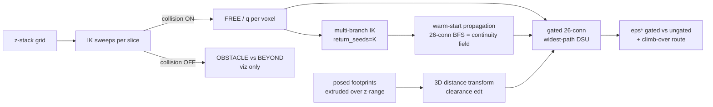

# From 2D to 2.5D: how the clearance metric learned to climb *over*

This note explains the ideas that took the scene-difficulty ("how boxed-in is the target?")
clearance metric from a flat single-slice measurement (`clearance_metric.py`) to a full 3D
one that lets the gripper route **up and over** an obstacle (`clearance_metric_3d.py`).

The jump is **not** "add a `z` axis to the arrays." That part is mechanical. The real work was
handling a subtlety that a single horizontal slice let us ignore: **whether the arm can actually
move continuously through the free space we found.** Everything below is about that.

---

## 1. What the 2D metric measures

On one fixed height `z`, we lay down an `(x, y)` grid of gripper positions and, for each cell,
run inverse kinematics (IK) twice:

- **collision ON** (occluder + table in the world) → succeeds ⇒ the cell is **FREE**;
- **collision OFF** (empty world) → separates the rest into **OBSTACLE** (blocked by clutter)
  vs **BEYOND-REACH** (the arm can't reach that pose at all).

We then take a Euclidean distance transform from the FREE cells to the occluder footprints
(clearance in metres) and run a **widest-path** search — a max-min bottleneck over FREE cells —
between the grasp cell and the pad cell. The bottleneck clearance is **`eps*`**: the tightest
squeeze on the least-bad route. Compare `eps*` to the gripper half-width and you get a
feasibility verdict.

**The limitation:** a single horizontal slice can only route *around* an obstacle in a plane.
A real arm can lift the gripper *over* it. The flat metric is blind to that option.

---

## 2. What "2.5D" means here

Stack many horizontal slices into a voxel volume and let the route move in `z` as well as `x, y`,
so it can climb over. We keep a **single fixed grasp orientation** (the whole stack is evaluated
at the target's grasp quaternion), which is why it's **2.5D**, not full 6-DOF configuration-space
planning: it's a 2D grid plus a height dimension, not the arm's entire joint space.

---

## 3. The problem that makes 3D hard: arm-configuration continuity

Hold your hand flat on a spot on the table. You can do it **elbow-out** or **elbow-tucked** — same
hand pose, two genuinely different arm shapes. To switch between them you must lift and swing the
elbow *through*; you cannot morph smoothly while keeping the hand pinned. Those distinct arm shapes
are the **IK branches**.

This arm is **6-DOF**, so the IK solution set for a given gripper pose is a **finite, discrete set**
of branches (elbow up/down, wrist flip, …). Moving the gripper continuously, the arm must stay on
**one** branch; jumping branches requires passing through a singularity — you can't do it during a
single continuous motion.

- **In 2D (one slice):** neighbouring cells almost always land on the *same* branch, so a straight
  move between two FREE cells is itself feasible. We called this the **no-mazy-middle** assumption,
  and it let us treat "both cells FREE" as "connected."
- **In 3D:** moving the gripper **straight up** between slices frequently *forces* a branch flip.
  So two vertically-adjacent FREE voxels can look connected in space while the arm has **no**
  continuous motion between them.

**Consequence:** the metric can no longer treat FREE-adjacency as connectivity. It needs a
**joint-space edge gate** — connect two neighbouring voxels only if the arm's configuration `q` at
each is *close* (max per-joint difference within a threshold `tau`, wrapping angles to `(-π, π]`).
This gate is optional in 2D and **mandatory** in 2.5D.

---

## 4. The three fields the 3D metric stitches together

| Field | Question it answers | Source |
|-------|---------------------|--------|
| **Reachability** (`label == FREE`) | *Can the gripper be here, collision-free?* | collision-ON IK sweep |
| **Continuity** (`q` per voxel + gate) | *Can the arm move continuously between here and its neighbour?* | IK joint solution + the gate |
| **Clearance** (`edt`) | *How far is here from a bottle?* (the widest-path values) | 3D distance transform |

The 2D metric only ever used the first and third. **The continuity field is the new ingredient**,
and getting it *trustworthy* was the crux of the whole effort.

---

## 5. Making the gate trustworthy: branch-hopping vs. real seams

Here is the trap. curobo's IK optimises **~100 random seeds** per pose and returns the single
**lowest-cost** solution (`ik.solve_batch`, `num_seeds=100`, `return_seeds=1`). When two branches
have nearly equal cost, *which* one it calls "best" is effectively a coin flip. So adjacent voxels
can report wildly different arm shapes **for no physical reason** — the branch "hops" on seed noise.

If we fed those raw configs into the gate, it would see fake jumps everywhere and wrongly declare
the arm stuck.

**Diagnostic (Phase 0).** We measured the joint jump across every pair of adjacent FREE cells —
exactly what the gate thresholds. At grasp height it was smooth; a few centimetres higher it became
**random speckle**. Two innocent explanations: (a) real forced flips, or (b) coin-flip noise.

**The tell.** A genuine branch-switch locus is a *critical variety* of the forward-kinematics map —
codimension ≥ 1, so in a 2D slice it **must** appear as a **curve/streak**, never as isolated dots.
Real seams are streaks; noise is confetti.

**The fix — warm-start continuity propagation.** Instead of taking curobo's coin-flip favourite:

1. Ask curobo for the **top-K branches** per voxel (`solve_batch(return_seeds=K)`; nearly free,
   since it already optimised ~100 seeds internally). → `_solve_grid_q_multi`.
2. Walk the FREE region with a BFS from a stable seed voxel; assign each voxel the candidate branch
   **closest to the neighbour it was reached from**. → `warm_start_branches` / `warm_start_branches_3d`.

This *collapses* spurious hops (if a nearby branch exists in the menu, it gets chosen) while **real
seams survive** (a voxel with no candidate near its neighbour keeps a large jump — BFS can't invent
a smooth branch that isn't there). Result: the speckle vanished and the remaining yellow formed
coherent streaks — the intended outcome. **The gate must read this warm-started field, never the raw
best-cost one.**

In 3D the propagation is **26-connected over the whole FREE volume**, so it enforces continuity
*vertically* — the edges a climb-over route rides on. We verified this by comparing the vertical
edge-jump distribution under per-slice-2D vs 3D propagation: 3D collapsed the tail almost entirely,
confirming a vertically-consistent branch field exists across most of the reachable volume.

---

## 6. The geometry: 3D clearance with a pass-over region

Each bottle's **posed collision mesh** gives a convex-hull `xy` footprint and a true world z-range
`[zlo, zhi]`. We **extrude** the footprint over that band into an `(nz, ny, nx)` occluder mask and
run an **anisotropic 3D distance transform** (`sampling=(zres, res, res)`).

The important consequence: **above `zhi` (the bottle's top) there is no occluder**, so clearance
there is *unbounded*. That unbounded region is exactly the "free to pass over the top" space — and
it's why the metric can return **`eps* = inf` (over the top)** when the best route lifts above the
bottle.

---

## 7. The metric: a gated 26-connected widest-path

The widest-path (Kruskal max-min) is generalised to the voxel grid:

- add FREE voxels in **descending clearance**, union each with already-added FREE neighbours;
- **26-connectivity** in 3D (instead of 8 in 2D);
- **gate:** union two neighbours only if their warm configs are within `tau`;
- the clearance of the voxel whose addition first connects the grasp and pad seeds is `eps*`.

We run it **twice**:

- **ungated** (reachable + clear only) — the old notion of a route, now in 3D;
- **gated** (adds the continuity constraint) — the real 2.5D metric.

The gap between them is the **cost of the branch seams**. The most informative case is
*ungated-merges-but-gated-disconnects*: a reachable, clear path exists, but no **continuous
single-branch** climb-over does — the seams block it. `eps* = inf` on the gated run means a clean
climb-over was found.

---

## 8. How the transition was de-risked

Built in phases, each independently checkable, with data saved (`.npz` / `.json`) so results can be
re-analysed offline rather than re-run on the GPU:

1. **z-stack + labelling** — verify the volume builds and reachability falls off with height.
2. **3D warm propagation** — verify vertical continuity (2D-per-slice vs 3D comparison).
3. **3D occluder clearance** — verify the footprint extrusion and the pass-over region.
4. **gated widest-path DSU** — the metric, ungated vs gated, with the climb-over route.

To keep the 3D story legible (a static 3D scatter reads poorly), the metric emits **collapses of the
3D structure into 2D/1D**: a **side elevation** (profile through grasp→pad showing the route arcing
over the bottle), a **clearance-along-route** line chart (the minimum *is* `eps*`), a **top-down**
plan coloured by height, and a **reachability-ceiling** heatmap.

---

## 9. Performance note

The runtime is ~99% curobo IK (`solve_batch`), dominated by the 100-seed-per-pose optimisation run
over the whole grid many times. The main levers, in order of impact: lower `--ik-seeds` (100→30 ≈
3×); solve the warm pass **only on FREE cells** (the rest is discarded anyway); optionally skip the
collision-OFF sweep (`--free-only`, which only affects the OBSTACLE/BEYOND *visualisation*, never the
metric); and coarsen `--res` / `--zres` / trim `--zmax` for scouting runs.

---

## One-line summary

**2D → 2.5D wasn't about adding a height axis; it was about admitting that a 6-DOF arm has discrete
configuration branches, that moving *up* often forces a branch flip, and then building a trustworthy
joint-continuity gate (warm-started, because raw IK branch-hops on noise) so the widest-path only
routes the gripper where the arm can actually, continuously, follow — including over the top.**
